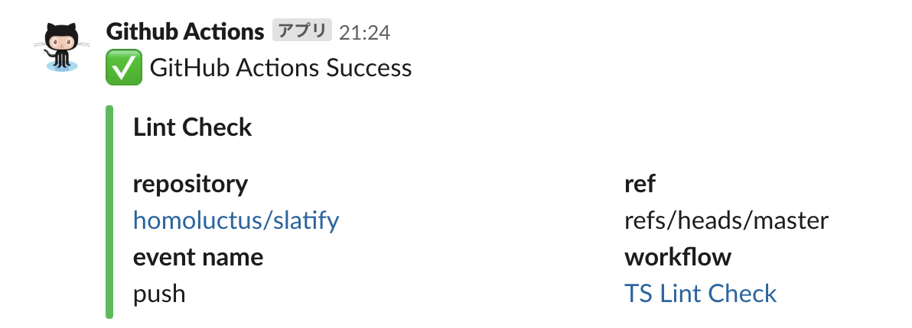
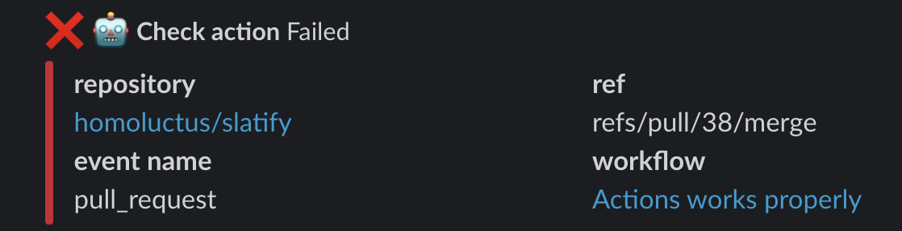
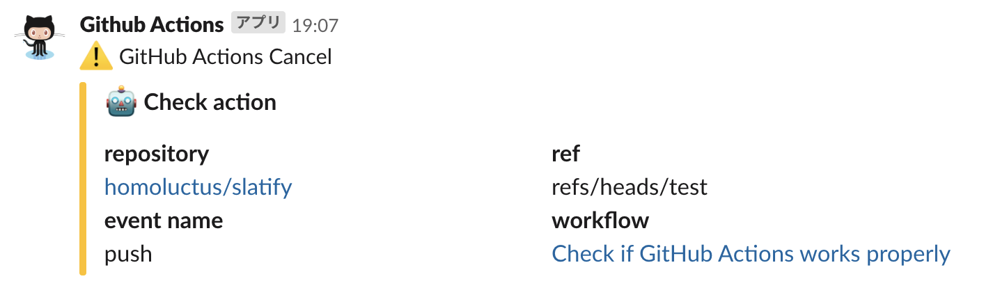

# Slatify


This is Slack Notification for GitHub Actions.<br>
Generated from [actions/javascript-template](https://github.com/actions/javascript-template).

# Feature
- Notify the result of GitHub Actions

# How to use
First of all, you need to set GitHub secrets for SLACK_WEBHOOK that is Incoming Webhook URL.<br>
You can customize the following parameters:

|with parameter|required/optional|default|description|
|:--:|:--:|:--|:--|
|type|required|N/A|The result of GitHub Actions job<br>This parameter value must contain `success`, `fail` or `cancel`<br>We recommend using ${{ job.status }}|
|job_name|required|N/A|Means slack notification title|
|url|required|N/A|Slack Incoming Webhooks URL<br>Please specify this key or SLACK_WEBHOOK environment variable<br>※SLACK_WEBHOOK will be deprecated|
|icon_emoji|optional|github|Slack icon|
|username|optional|Github Actions|Slack username|
|channel|optional|Use Slack Incoming Webhook configuration|Slack channel name|

Please refer `action.yml` for more details.

## Example
```..github/workflows/main.yml
- name: Slack Notification
  uses: homoluctus/slatify@master
  if: always()
  with:
    type: ${{ job.status }}
    job_name: '*Lint Check*'
    channel: '#random'
    url: ${{ secrets.SLACK_WEBHOOK }}
```

# Slack UI Example
## Success Case



## Failure Case



## Cancel Case



## Preview


# Contribute
1. Fork this repository
2. Pull your repository in local machine
3. Update original repository
4. Checkout "develop" branch based "remotes/origin/develop" branch
5. Work on "develop" branch
6. Push you changes to your repository
7. Create a new Pull Request

# LICENSE

[The MIT License (MIT)](https://github.com/homoluctus/slatify/blob/master/LICENSE)