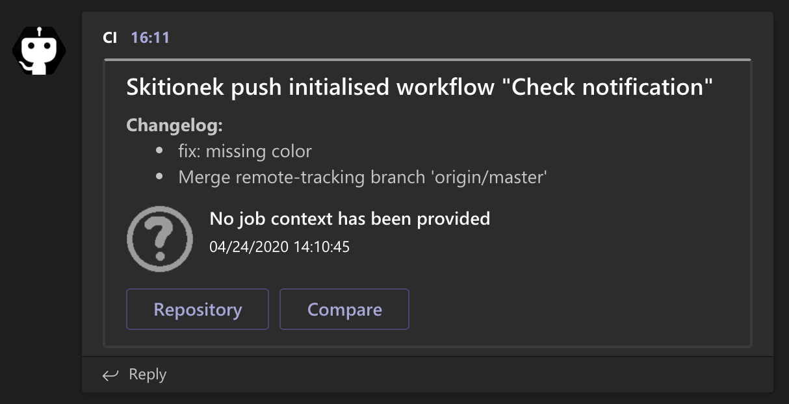
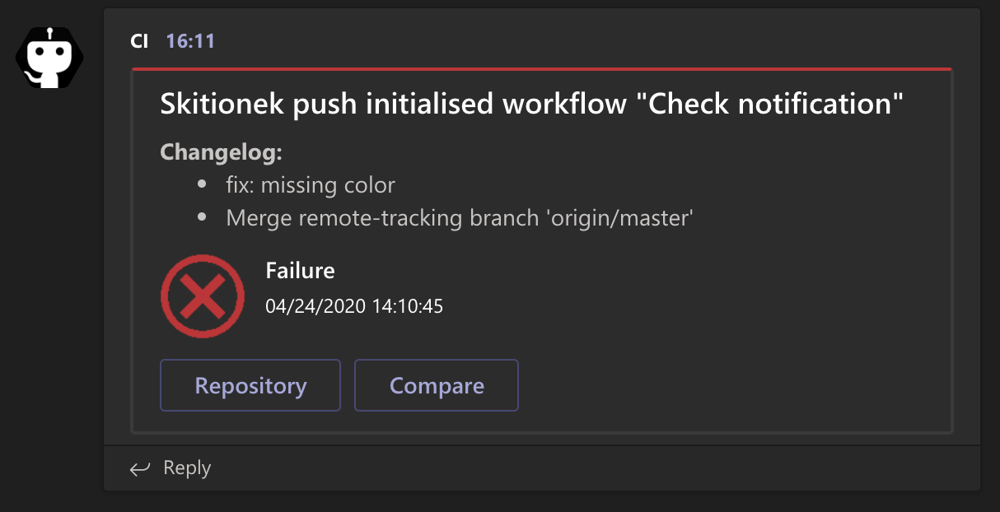
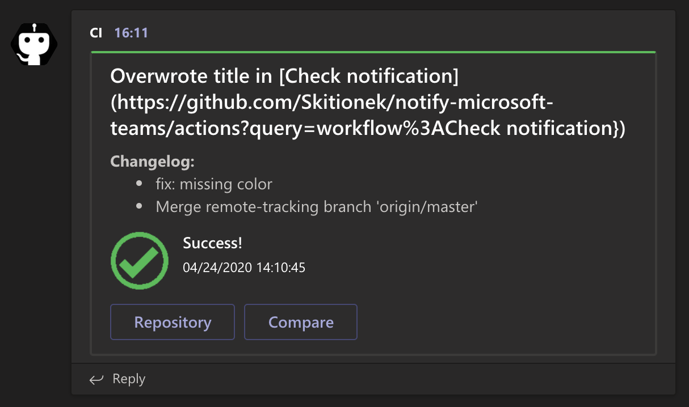
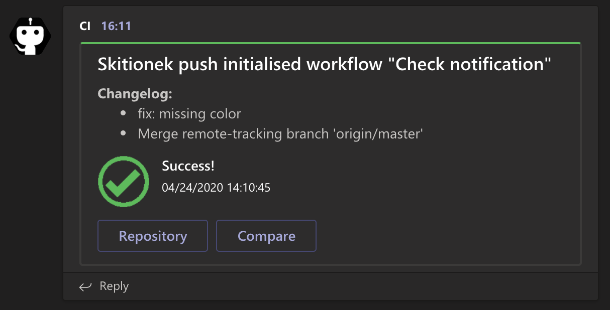
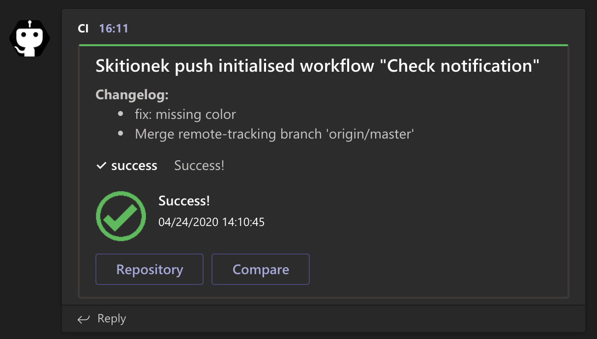
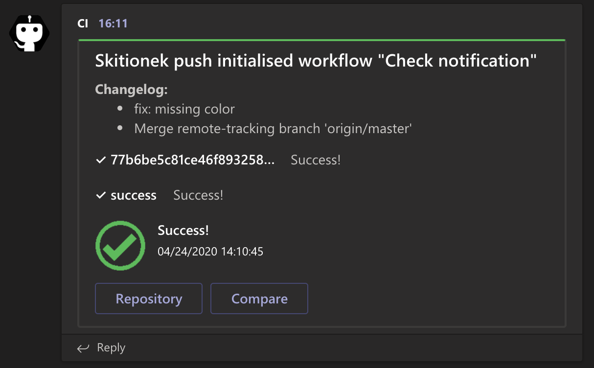

# Notify Microsoft Teams


Teams notify action inspired by [git:homoluctus/slatify](https://github.com/homoluctus/slatify) (for Slack).

This is Microsoft Teams Notification for GitHub Actions.<br>
Generated from [actions/javascript-template](https://github.com/actions/javascript-template).

# ToC

- [Feature](#Feature)
- [Usage](#Usage)
  - [Examples](#Examples)
- [Microsoft Teams UI](#Microsoft_Teams_UI)
- [Contribution](#Contribution)
- [LICENSE](#LICENSE)

# Feature
- Notify the result of GitHub Actions
- Support all job statuses (reference: [job-context](https://help.github.com/en/articles/contexts-and-expression-syntax-for-github-actions#job-context))
- Logs relevant jobs and steps along with their output in case of failure
- Provides flexible interface to overwrite any part of the message
- Allows sending raw json-formatted messages directly from action definition

# Usage
First of all, you need to set GitHub secrets for MSTEAMS_WEBHOOK that is Incoming Webhook URL.

You can customize the following parameters:

|with parameter|required/optional|default|description|
|:--:|:--:|:--|:--|
|webhook_url|optional|$MSTEAMS_WEBHOOK|Microsoft Teams Incoming Webhooks URL<br>Please specify this key or MSTEAMS_WEBHOOK environment variable|
|job|optional|{}}|JSON parsed job context|
|steps|optional|{}|JSON parsed steps context|
|needs|optional|{}|JSON parsed needs context|
|dry_run|optional|False|Do not actually send the message|
|raw|optional|''|JSON object to send to Microsoft Teams|
|overwrite|optional|''|JSON like object to overwrite default message (executed with eval)|

Please refer [action.yml](./action.yml) for more details.

## Examples

```yml
name: Check notification

on:
  push: {}
  release: {}

jobs:
  success:
    name: One with everything
    runs-on: ubuntu-18.04
    steps:
      - uses: actions/checkout@master
      - name: Microsoft Teams Notification
        uses: skitionek/notify-microsoft-teams@master
        if: always()
        with:
          webhook_url: ${{ secrets.MSTEAMS_WEBHOOK }}
          needs: ${{ toJson(needs) }}
          job: ${{ toJson(job) }}
          steps: ${{ toJson(steps) }}
          dry_run: True


  without_optional_params:
    name: One with little info
    runs-on: ubuntu-18.04
    steps:
      - uses: actions/checkout@master
      - name: Microsoft Teams Notification
        uses: skitionek/notify-microsoft-teams@master
        if: always()
        with:
          webhook_url: ${{ secrets.MSTEAMS_WEBHOOK }}

  with_overwrite:
    name: One with overwrite
    runs-on: ubuntu-18.04
    steps:
      - uses: actions/checkout@master
      - name: Microsoft Teams Notification
        uses: skitionek/notify-microsoft-teams@master
        if: always()
        with:
          webhook_url: ${{ secrets.MSTEAMS_WEBHOOK }}
          overwrite: "{title: `Overwrote title in ${workflow_link}`}"

  with_raw:
    name: One with raw data
    runs-on: ubuntu-18.04
    steps:
      - uses: actions/checkout@master
      - name: Microsoft Teams Notification
        uses: skitionek/notify-microsoft-teams@master
        if: always()
        with:
          webhook_url: ${{ secrets.MSTEAMS_WEBHOOK }}
          raw: >-
            {
              "@type": "MessageCard",
              "@context": "http://schema.org/extensions",
              "title": "No ${variables} avaliable in here"
            }

  if_failure:
    name: Only if failure
    runs-on: ubuntu-18.04
    steps:
      - uses: actions/checkout@master
      - name: Microsoft Teams Notification
        uses: skitionek/notify-microsoft-teams@master
        if: failure()
        with:
          webhook_url: ${{ secrets.MSTEAMS_WEBHOOK }}
```

# Microsoft Teams UI








# Contribution

You are welcome to contribute in any form. I would gladly improve this package.

# LICENSE

[The MIT License (MIT)](https://github.com/Skitionek/notify-microsoft-teams/blob/master/LICENSE)
