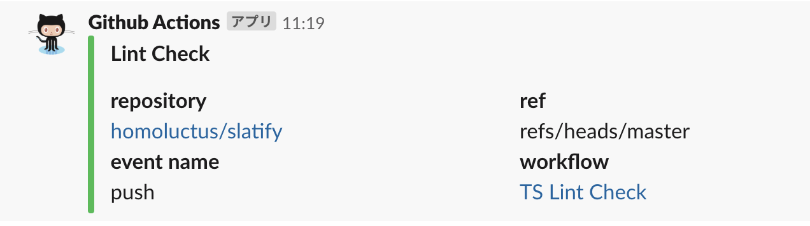
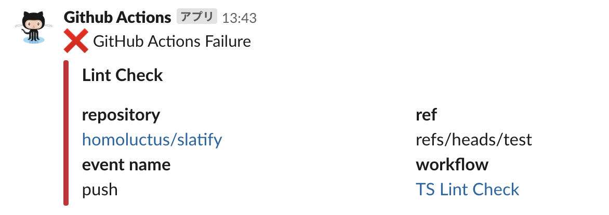

# Slatify
This is Slack Notification for Github Actions.<br>
Generated from [actions/container-toolkit-template](https://github.com/actions/container-toolkit-template).

# Feature
- Notify the result of Github Actions

# How to use
First of all, you need to set Github secrets for SLACK_WEBHOOK that is Incoming Webhook URL.<br>
You can customize the following parameters:
- type (required)
- job_name (required)
- icon_emoji (optional)
- username (optional)
- channel (optional)

Please refer `action.yml` for more details.

## Example
```..github/workflows/main.yml
- name: Slack Notification
  uses: homoluctus/slatify@master
  if: always()
  with:
    type: ${{ job.status }}
    job_name: '*Lint Check*'
    channel: '#random'
  env:
    SLACK_WEBHOOK: ${{ secrets.SLACK_WEBHOOK }}
```

# Slack UI
## success



## failure



## Preview


